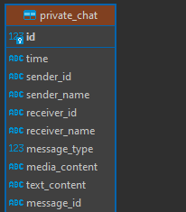
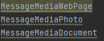
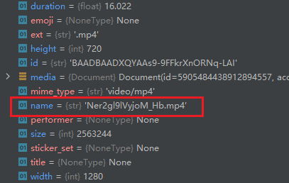
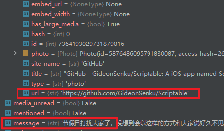
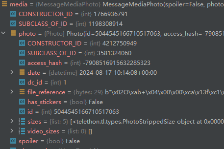
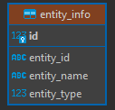
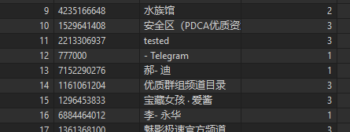
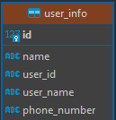

### 1.配置文件config.ini

通过`config.ini`文件进行消息配置，都不需要加引号，如果出现报错，先检查一下配置文件是否正确

```ini
[message]
#类型None或整数，每个聊天，获取多少条聊天记录,None表示全部
#1000条记录差不多网络io要个五秒，当然根据聊天记录重要性，私聊并不会限制
#建议不超过100万

limit = 10000

#tg数据包传输的是加密的数据，还要进行AES-IGE解密，比较耗时
#wait_time大部分情况下不用修改，因为使用wait_time时往往是因为文件下载过慢
#可以在[file]节中对文件下载进行更精细化的控制
wait_time = None
#是否需要修改lastseen
#lastseen只能反应最后一次操作ui窗口的时间
#不能证明telegram.exe进程不存在于后台
#value：true/false  |  1/0  |  yes/no
[privacy]
edit_lastseen = false

[file]
#获取文件的类型，默认all是下载聊天中的全部文件类型
#应当写成mime类型的格式：用列表控制比如[photo,video,document]，或用,分隔的其他形式
#由于文件大小过滤的存在，速度已非常可观，因此该属性意义不大
need_file_type = all

#下载大小过滤，单位是Bytes，即下载文件时,所有大于该值的文件都不下载
#如果不想下载任何文件就默认改成0
max_size = 0

#下载的文件和聊天数据库，指定一个保存目录，不指定写None在main.py文件夹底下
save_path = None


```

### 2.使用方法

无需虚拟环境，安装依赖：pip install -r requirements.txt，通过命令行运行，命令行需要两个参数

#####  -path

字符串，tdata文件夹的路径，必须要精确到tdata目录

```
-path "D:\Project\tgMessage\tdata"
```

#####  -proxy

字符串，代理的方式，ip和端口，能连telegram服务器可不加

```
-proxy "('http', '127.0.0.1', 7890)"
```

##### **-库修复**

由于爬虫依赖于一些基本库，其中opentele库存在一些问题，需要对opentele修复。找到运行环境下的Python库目录，找到opentele下的td文件夹‘**Python\Lib\site-packages\opentele\td**’，然后把“**tgMessage\fix**”中两个文件替换掉td目录中的对应文件

### 3.使用示例

`python main.py -path "E:\tmp\tdata" -proxy "('http', '127.0.0.1', 7890)"`

### 4.输出结果

聊天记录数据库和聊天中的文件都保存在config.ini中的save_path目录下，如果没有指定就在运行目录底下

#### 4.1数据表和数据说明

数据库名称为userid，表分为五张私聊、群聊、频道、对话框实体和Userinfo

##### 4.1.1存储消息的表

ER图如下



id是自增主键；时间是utc时间，和北京时间差8小时；senderid是消息的发送者id；

name是lastname+firstname的顺序，中间用'-'分隔；receiverid是当前对话框对方实体的id属性，主要是定位自己发出的消息属于哪个对话框；

对于一条消息，类型大致分为两种，文件消息和非文件消息，文件消息可以同时存在文字和文件。对于文件消息官方总体上分为三种，webPage、Photo、Document，因此表中type区分最上层的四种文本、网页、图片、文件，分别由1、2、3、4表示。其中文本类型MEDIA_CONTENT默认为空。



对于Document又可细分若干文件类型，主要由后缀决定mime_type,具体多少种未知，MEDIA_CONTENT只存储文件名(不存在为空)，可以用后缀判断，另一列TEXT_CONTENT存储消息文字信息(不存在为空)



对于webPage，MEDIA_CONTENT存储其url地址，另一列TEXT_CONTENT存储文字信息



对于Photo没有明显的标识符，这里MEDIA_CONTENT直接置空，另一列TEXT_CONTENT存储文字信息



##### 4.1.2 实体表



当前tdata用户的所有对话框实体其中type：1是用户、2是群、3是频道



##### 4.1.3 个人信息表



name由lastname+firstname组成中间用“-”分割，其他都如同字段名称所示，可能存在某些数据为空

### 其他说明

支持增量获取：爬虫运行时会记录对当前tdata的爬取时间dateA，然后下次爬取时，只获取dateA之后的消息，dateA和现实实际时间误差精确为1秒

